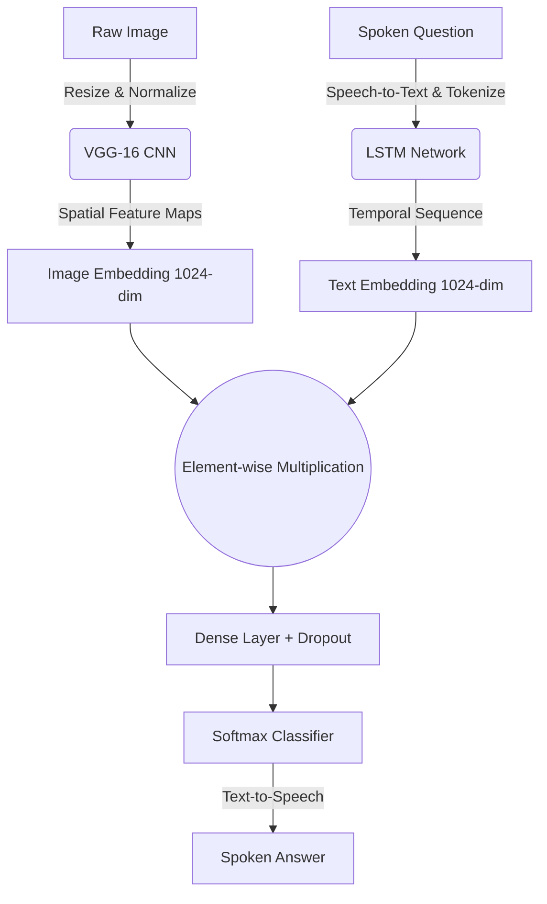

<div align="center">

# 👁️‍🗨️ Visual Question Answering (VQA)

**Bridging Vision and Language**

> *"To perceive is one thing; to articulate that perception is another. True intelligence lies at their intersection."*

</div>

<br>

Welcome to the **Visual Question Answering (VQA)** project. This repository represents an exploration into multimodal artificial intelligence, designed to fuse computer vision with natural language processing. The ultimate goal? To empower machines to look at an image, comprehend a question asked about that image, and synthesize an accurate, context-aware answer. 

> [!NOTE]
> **Accessibility First**
> At its core, this project is an accessibility initiative. By giving machines the ability to describe and answer questions about the visual world, we create powerful tools for the visually impaired, allowing them to interact with their surroundings through a seamless, voice-driven interface.

---

## 🧠 The Philosophy and Purpose

The human brain processes the world through multiple modalities simultaneously. When we see a scene, we don't just register pixel values; we extract semantic meaning. When we hear a question, we map those words to our conceptual understanding of the world. 

This project aims to replicate that dual-processing capability, featuring two distinct deployments tailored for specific environments:

| Context | Environment | Focus |
|:---|:---|:---|
| 📱 **The Edge** | Android App | Designed for extreme portability and offline capability, assisting visually impaired users in real-time. |
| ☁️ **The Cloud** | Web App | Built for unrestricted computational power, leveraging state-of-the-art transformer architectures for complex reasoning. |

---

## ⚙️ System Architectures

To accommodate both edge and cloud environments, this repository implements two entirely different architectural paradigms.

### 1. The Mobile Edge Architecture (CNN + LSTM Fusion)
*Deployed on Android via TensorFlow Lite*

For the mobile application, efficiency and offline availability are paramount. We utilize a classic dual-encoder strategy. 



### 2. The Cloud Architecture (Vision-and-Language Transformer)
*Deployed on the Web via FastAPI and PyTorch*

The web interface utilizes the **ViLT (Vision-and-Language Transformer)** model. Unlike the edge architecture which processes vision and language separately before merging them, ViLT tokenizes both the image patches and the text tokens directly into a single, massive transformer network.

- **Image Processing:** Patch-based visual embeddings without the need for heavy CNN feature extractors.
- **Text Processing:** BERT-style subword tokenization.
- **Inference:** HuggingFace `vilt-b32-finetuned-vqa` weights provide high-accuracy, zero-shot-like capabilities on complex, unseen grammatical structures.

---

## 📁 Directory Organization

The repository is modularly structured to separate the training environments from the deployment platforms.

| Directory | Purpose | Contents |
|:---|:---|:---|
| 📓 **`/Model`** | The research and training nexus. | Jupyter notebooks detailing data preprocessing, vocabulary generation, training, and `.tflite` conversion. |
| 📱 **`/Android app`** | The native mobile application workspace. | Java-based source code, Android manifest, layout XMLs, and offline AI assets for accessibility-driven inference. |
| 🌐 **`/WebApp`** | The full-stack web portal. | The `backend/` runs the FastAPI inference server, while the `frontend/` provides a highly responsive, animated, vanilla web interface. |

---

## 🚀 Deployment & Setup Guide

### 🌐 Running the Web Platform
Ensure you have **Python 3.10+** installed.

```bash
# 1. Navigate to the backend directory
cd WebApp/backend

# 2. Install machine learning and server dependencies
pip install -r requirements.txt

# 3. Start the FastAPI backend
# Note: The heavy transformer weights download automatically on initial startup.
python main.py
```
> [!TIP]
> Once the server is running on `localhost`, simply open `WebApp/frontend/index.html` in any modern web browser to access the interface!

<br>

### 📱 Running the Android Application
Ensure you have the latest version of **Android Studio** installed.

1. Launch Android Studio and select **"Open an existing project"**.
2. Navigate to and select the `Android app/` folder in this repository.
3. Allow the Gradle build system to resolve and sync all dependencies.
4. Connect a physical Android device and click **Run**.

> [!WARNING]
> We strongly recommend a **physical Android device** over an emulator to ensure full camera and microphone hardware support for the accessibility features.

---

<div align="center">

### Acknowledgments

This project is built upon the foundational work of the VQA dataset creators, the developers of PyTorch and TensorFlow, and the open-source advancements in transformer architectures by HuggingFace. 

*It stands as a testament to the fact that advanced artificial intelligence can, and should, be utilized to make the world more accessible for everyone.*

</div>