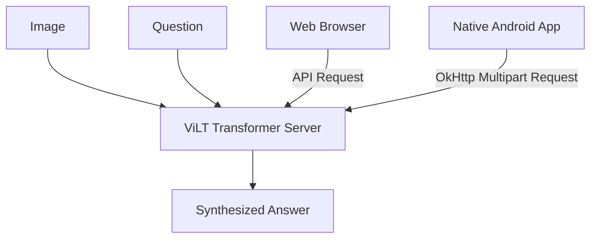

<div align="center">

# 👁️‍🗨️ Visual Question Answering (VQA)

**Bridging Vision and Language**

> *"To perceive is one thing; to articulate that perception is another. True intelligence lies at their intersection."*

</div>

<br>

Welcome to the **Visual Question Answering (VQA)** project. This repository represents an exploration into multimodal artificial intelligence, designed to fuse computer vision with natural language processing. The ultimate goal? To empower machines to look at an image, comprehend a question asked about that image, and synthesize an accurate, context-aware answer. 

> [!NOTE]
> **Accessibility First**
> At its core, this project is an accessibility initiative. By giving machines the ability to describe and answer questions about the visual world, we create powerful tools for the visually impaired, allowing them to interact with their surroundings through a seamless interface.
> 
> **Enhanced Voice Features:**
> - 🎙️ **Speech-to-Text (Voice Input):** Users can click the microphone button to speak their questions instead of typing.
> - 🔊 **Text-to-Speech (Voice Output):** The AI automatically reads the answer out loud. Users can easily toggle this feature on/off using the speaker button right next to the microphone.

---

## 🧠 The Philosophy and Purpose

The human brain processes the world through multiple modalities simultaneously. When we see a scene, we don't just register pixel values; we extract semantic meaning. When we hear a question, we map those words to our conceptual understanding of the world. 

This project aims to replicate that dual-processing capability, featuring a unified architecture that provides state-of-the-art accuracy across all platforms:

| Context | Environment | Focus |
|:---|:---|:---|
| 📱 **The Edge** | Android App | Designed for portability and performance, utilizing a 100% Native Android UI with Java and XML, directly connecting to powerful cloud models. |
| ☁️ **The Cloud** | Web App | Built for unrestricted computational power, leveraging state-of-the-art transformer architectures for complex reasoning. |

---

## ⚙️ System Architecture (Vision-and-Language Transformer)

To provide the highest possible accuracy and a unified user experience, both the Android and Web platforms now utilize a single, powerful cloud architecture.

### The ViLT Architecture
*Deployed on Hugging Face Spaces via FastAPI and PyTorch*

The system utilizes the **ViLT (Vision-and-Language Transformer)** model. ViLT tokenizes both the image patches and the text tokens directly into a single, massive transformer network.

- **Image Processing:** Patch-based visual embeddings without the need for heavy CNN feature extractors.
- **Text Processing:** BERT-style subword tokenization.
- **Inference:** Hugging Face `vilt-b32-finetuned-vqa` weights provide high-accuracy, zero-shot-like capabilities on complex, unseen grammatical structures.



---

## 📁 Directory Organization

The repository is modularly structured to separate the training environments from the deployment platforms.

| Directory | Purpose | Contents |
|:---|:---|:---|
| 📓 **`/Model`** | The research and training nexus. | Jupyter notebooks detailing data preprocessing and legacy model generation. |
| 📱 **`/Android app`** | The native mobile application workspace. | A fully native Android application built with XML Layouts, Java, and OkHttp to securely interface with the cloud backend. Features native Camera, Gallery, Speech-to-Text, and Text-to-Speech intents. |
| 🌐 **`/WebApp`** | The full-stack web portal. | The `backend/` runs the FastAPI inference server, while the `frontend/` provides a highly responsive, animated, vanilla web interface. |

---

## 🚀 Deployment & Setup Guide

### 🌐 Running the Web Platform Locally
Ensure you have **Python 3.10+** installed.

```bash
# 1. Navigate to the backend directory
cd WebApp/backend

# 2. Install machine learning and server dependencies
pip install -r requirements.txt

# 3. Start the FastAPI backend
# Note: The heavy transformer weights download automatically on initial startup.
python main.py
```
> [!TIP]
> Once the server is running on `localhost`, simply open `WebApp/frontend/index.html` in any modern web browser to access the interface!

<br>

### ☁️ Cloud Deployment (Vercel & Hugging Face)

The Web Platform is fully configured for cloud deployment:

1. **Backend (Hugging Face Spaces)**:
   - Create a new Hugging Face Space using the Docker template.
   - Upload the contents of `WebApp/backend`.
   - The FastAPI server will automatically install dependencies and expose the `/predict` endpoint.

2. **Frontend (Vercel)**:
   - Update the `vercel.json` file in `WebApp/frontend` to route `/api/*` to your Hugging Face Space URL.
   - Deploy the repository to [Vercel](https://vercel.com) and set the **Root Directory** to `WebApp/frontend`.

<br>

### 📱 Running the Android Application
Ensure you have the latest version of **Android Studio** installed.

1. Launch Android Studio and select **"Open an existing project"**.
2. Navigate to and select the `Android app/` folder in this repository.
3. Allow the Gradle build system to resolve and sync all dependencies (including `OkHttp`).
4. Connect a physical Android device and click **Run** to compile the fully native APK.

> [!WARNING]
> We strongly recommend a **physical Android device** over an emulator to ensure full camera hardware support for taking pictures of your surroundings.

---

<div align="center">

### 💡 Skills & Concepts Covered

This repository serves as a comprehensive showcase of modern AI and App Development concepts, successfully bridging multiple domains into a single functional product:

| **Domain** | **Concepts Demonstrated** |
| :--- | :--- |
| **Deep Learning** | ✅ CNN / ViT (Image Features)<br>✅ LSTM / Transformer Architectures<br>✅ Sequence Models & Word Embeddings<br>✅ Encoder-Decoder Concepts |
| **Multimodal AI** | ✅ Multimodal Learning (Image + Text)<br>✅ Feature Fusion<br>✅ Question Understanding<br>✅ Answer Generation |
| **Core AI Fields**| ✅ Natural Language Processing (NLP)<br>✅ Computer Vision (CV) |
| **Voice & Speech** | ✅ Speech Recognition (Speech-to-Text)<br>✅ Text-to-Speech (TTS) |
| **Engineering** | ✅ Mobile App Development (Android)<br>✅ Accessibility-First Design |

</div>

<br>

<div align="center">

### Acknowledgments

This project is built upon the foundational work of the VQA dataset creators, the developers of PyTorch and TensorFlow, and the open-source advancements in transformer architectures by HuggingFace. 

*It stands as a testament to the fact that advanced artificial intelligence can, and should, be utilized to make the world more accessible for everyone.*

</div>